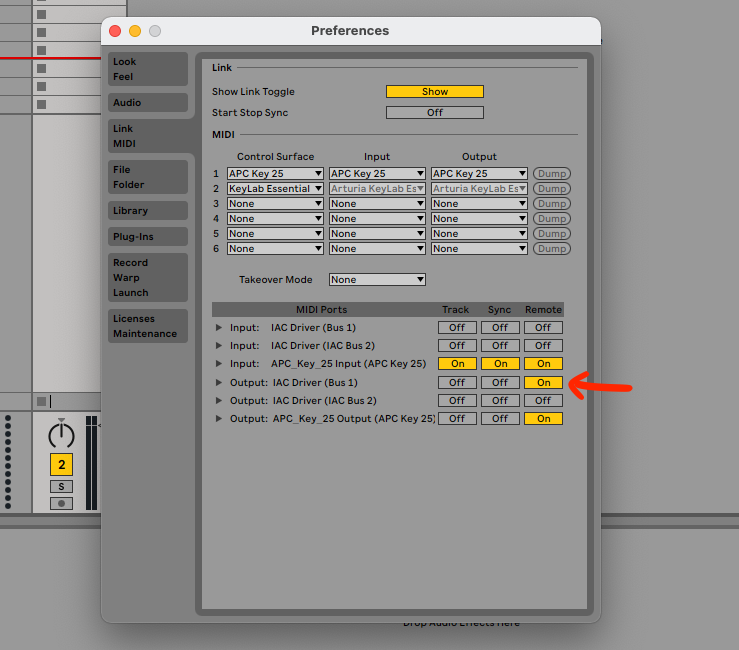

# AKAI APC Key 25 LED Feedback fix
 Solution to fix bug in AKAI APC light feedback

## AKAI APC Key 25 problem/bug:

In Ableton Live I midi mapped some of the grid buttons of the APC Key 25 to toggle controls, it works fine but the led colors do not change so you can't know whether the midi mapped controls are ON or OFF.

Doing some reaserch on the internet I found out that Ableton sends the midi information through the "Remote" midi ports but the AKAI does not react to it.

Each button of the APC Key grid corresponds to a note, the midi message to change the led color is:
</br>```NOTE_ON + <note_of_the_button> + VELOCITY_VALUE```

The velocity value defines which color the led should be:
* 0=off,
* 1=green,
* 2=green blink,
* 3=red,
* 4=red blink,
* 5=yellow,
* 6=yellow blink,
* 7-127=green

Ableton Live sends the following message when the midi mapped control is OFF:</br>```NOTE_OFF + <note_of_the_button> + 64```

This python script detects when this type of messages are sent by Ableton Live to the Midi Remote Output Ports using a virtual midi port, then I translate those to midi messages that makes the APC Key 25 change the led color correctly:<br/>```NOTE_ON + <note_of_the_button> + 3 (RED COLOR)```

## Ableton Live configuration

You have to use a virtual midi port (in my case I use the Mac OSX default "IAC Driver (Bus 1)") and enable "Remote" in its Output port in Ableton Live's settings:



## Mac OSX .plist (in order to run it always in background and forget about it)

I've added a .plist config that should be placed in ```~/Library/LaunchAgents/``` folder in order run the script when the computer starts and keep it running in background.

## Some links to sources that helped me understand and fix this problem

https://www.youtube.com/watch?v=RYMRiGQtTz0
https://forum.ableton.com/viewtopic.php?t=149974
